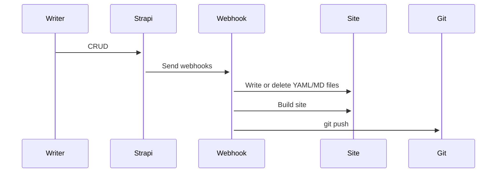

# Hugo theme

## Getting started

### Hugo, GNU Make

- Windows: `scoop install make yq hugo-extended`
- Debian: `sudo apt install make yq hugo`
- Arch: `yay -S make yq hugo`
- MacOS: `brew install make yq hugo`

Or [install Hugo from Tarbal](https://gohugo.io/getting-started/installing/#install-hugo-from-tarball)

## Development

```bash
# Run the linters
make lint

# Download ionicons
make svg

# Launch the debug server
make run

# Build the site for production
make build
```

### Theme

Use [Material Theme Builder](https://m3.material.io/theme-builder#/custom) to generate CSS in `assets/scss/vendors/material-theme`

### How it works?



### What is Hugo

Hugo is a fast and modern static site generator written in Go, and designed to make website creation fun again. [^1]

### Why Hugo? [^2]

- Static site, extremely fast & secure
- Can be hosted anywhere
- Run without the need for a database or dependencies runtimes
- Extremely fast build times (< 1 ms per page)
- Fun

### Directory structure [^3]

```md
├── archetypes
├── config.toml
├── content
├── data
├── layouts
├── static
└── themes
```

`layouts`: stores templates in the form of `.html` files.

```md
├── layouts
    ├── partials
    ├── shortcodes
    ├── index.html
    ├── 404.html
```

- `layouts/index.html` — the index page template
- `layouts/404.html` — the 404 page template

Partials are smaller, context-aware components in your list and page templates that can be used economically to keep your templating DRY. [^4]

- `layouts/partials/[article | document | ...]/*.html` — components are used for a the specific section.
- `layouts/partials/shared/*.html` — components are used in many sections
- `layouts/partials/*.html` — components are used in the global templates

### Config file

The site use the `config.yaml` as the Hugo config file. [^5]

### Content organization

Hugo uses the `content` directory for building pages, each directory is a section.

### Seperate SCSS/JS for a section

- `assets/scss/main.scss` — used for all pages
- `assets/scss/<section>.scss` — load for that `section` only if it exists
- `assets/js/main.js` — used for all pages
- `assets/js/<section>.js` — used for that `section` only if it exists

For example, for overwrite the home page:

- Write your SCSS in `assets/scss/sections/home/*.scss`
- Import them into `assets/scss/home.scss`
- Write your JS code in `assets/js/sections/home/*.js`
- Import them into `assets/js/home.js`

### Templates

 Hugo uses Go’s `html/template` and `text/template` libraries as the basis for the templating. [^6]

 ```html
 {{ printf "%#v" . }}
 {{ printf "%#v" $.Site }}
 {{ printf "%#v" .Permalink }}

 {{ range .Pages }}
  {{/* The context, ".", is now each one of the pages as it goes through the loop */}}
  {{ printf "%#v" . }}
{{ end }}
 ```

### Template Debugging

You can use Go templates’ printf function to debug your Hugo templates. These snippets provide a quick and easy visualization of the variables available to you in different contexts. [^7]

## Refrences

[^1]: https://gohugo.io/about/what-is-hugo/
[^2]: [Hugo Features](https://gohugo.io/about/features/)
[^3]: [Directory Structure](https://gohugo.io/getting-started/directory-structure/)
[^4]: [Partial Templates](https://gohugo.io/templates/partials/)
[^5]: [Configure Hugo](https://gohugo.io/getting-started/configuration/#all-configuration-settings)
[^6]: [Templates](https://gohugo.io/templates/)
[^7]: [Template Debugging](https://gohugo.io/templates/template-debugging/)
