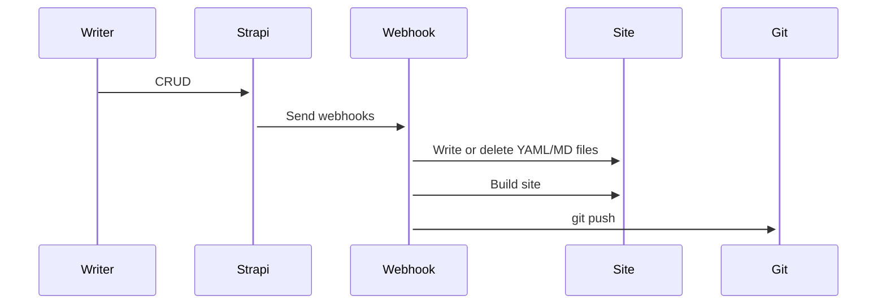

# Hugo theme

## Getting started

### Hugo, GNU Make

- Windows: `scoop install hugo-extended make`
- Linux: `sudo apt install hugo make`
- MacOS: `brew install hugo make`

Or [install Hugo from Tarbal](https://gohugo.io/getting-started/installing/#install-hugo-from-tarball)

## Development

```bash
# To launch the debug server
make run

# To build the site for production
make build
```

### How it works?



### What is Hugo

Hugo is a fast and modern static site generator written in Go, and designed to make website creation fun again. [^1]

### Why Hugo? [^2]

- Static site, extremely fast & secure
- Can be hosted anywhere
- Run without the need for a database or dependencies runtimes
- Extremely fast build times (< 1 ms per page)
- Fun

### Directory structure [^3]

```
├── archetypes
├── config.toml
├── content
├── data
├── layouts
├── static
└── themes
```

`layouts`: stores templates in the form of `.html` files.

```
├── layouts
    ├── partials
    ├── shortcodes
    ├── index.html
    ├── 404.html
```

- `layouts/index.html` — the index page template
- `layouts/404.html` — the 404 page template

Partials are smaller, context-aware components in your list and page templates that can be used economically to keep your templating DRY. [^4]

- `layouts/partials/[article | document | ...]/*.html` — components are used for a the specific section.
- `layouts/partials/shared/*.html` — components are used in many sections
- `layouts/partials/*.html` — components are used in the global templates


### Config file

The site use the `config.yaml` as the Hugo config file. [^5]

### Content organization

Hugo uses the `content` directory for building pages, each directory is a section.

### Templates

 Hugo uses Go’s `html/template` and `text/template` libraries as the basis for the templating. [^6]


## Refrences

[^1]: https://gohugo.io/about/what-is-hugo/
[^2]: [Hugo Features](https://gohugo.io/about/features/)
[^3]: [Directory Structure](https://gohugo.io/getting-started/directory-structure/)
[^4]: [Partial Templates](https://gohugo.io/templates/partials/)
[^5]: [Configure Hugo](https://gohugo.io/getting-started/configuration/#all-configuration-settings)
[^6]: [Templates](https://gohugo.io/templates/)
