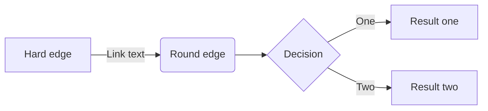
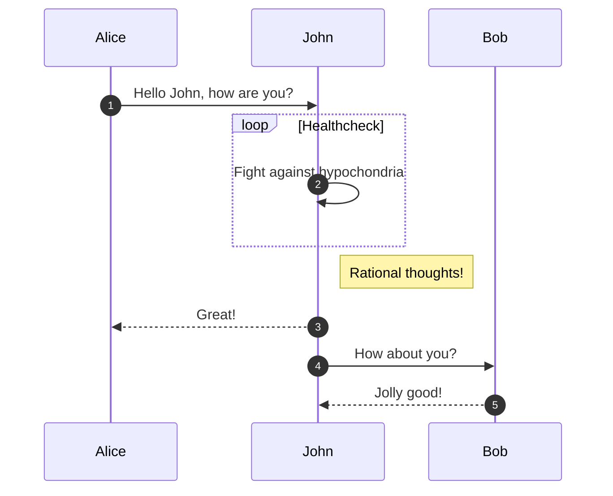
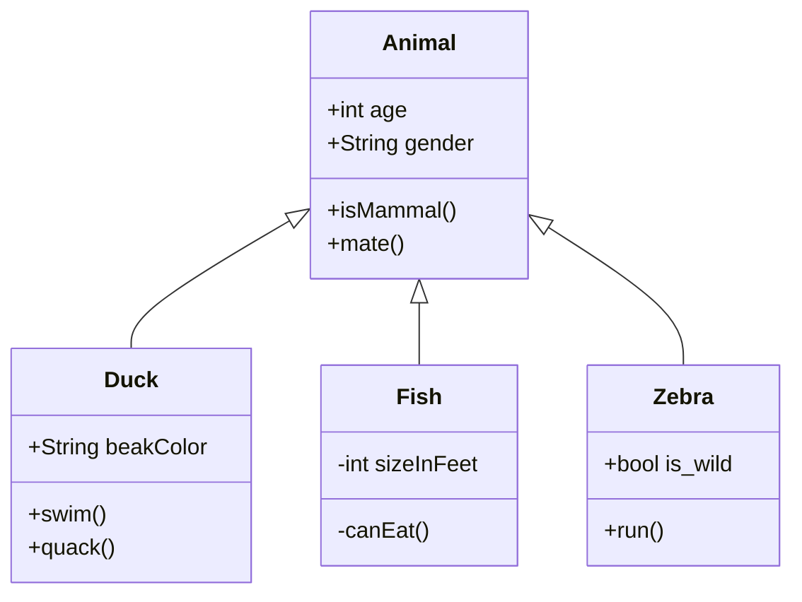
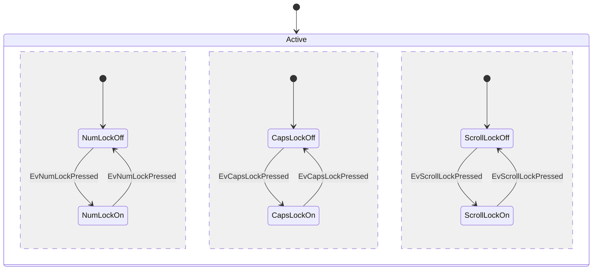
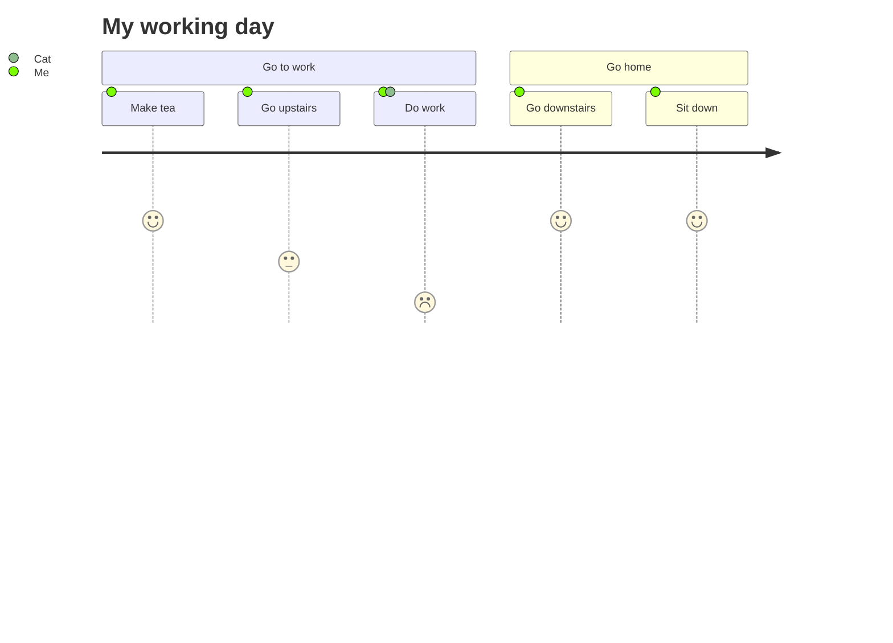
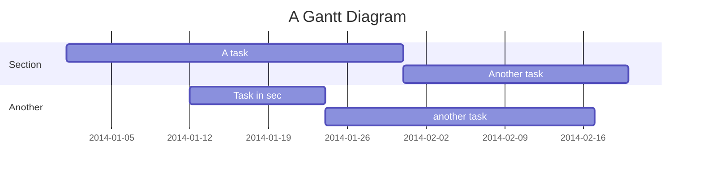
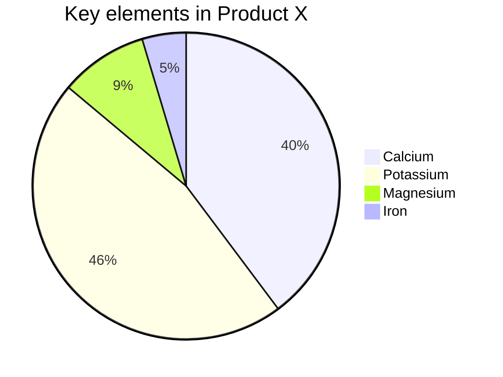

**[Mermaid](https://mermaid-js.github.io/mermaid/#/) lets you create diagrams using text and code**. This simplifies the maintenance of complex diagrams. It is a Javascript based diagramming and charting tool that renders Markdown-inspired text definitions to create and modify diagrams dynamically.

## Flowchart

## Sequence diagram

## Class diagram

## State diagram

## User Journey Diagram

## Gantt diagram

## Pie chart diagram

