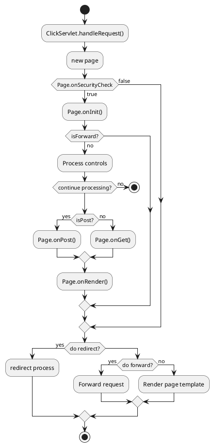
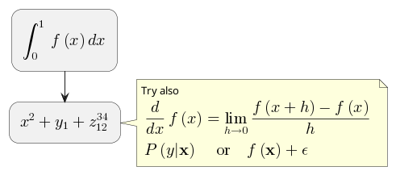
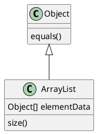
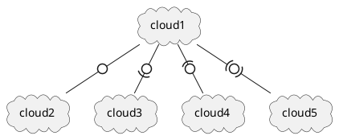
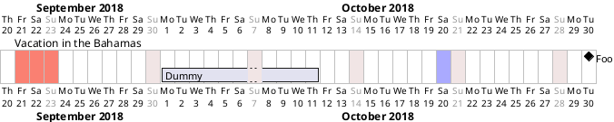
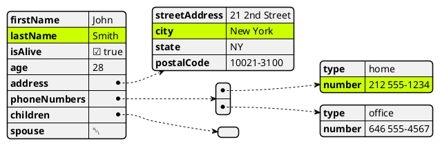

[**PlantUML**](https://plantuml.com/) is used to draw UML diagrams, using a simple and human readable text description.

## Activity

https://plantuml.com/activity-diagram-beta

## Maths

https://plantuml.com/ascii-math

## Classes

https://plantuml.com/class-diagram

## Deployment

https://plantuml.com/deployment-diagram

## Gantt

https://plantuml.com/gantt-diagram

## JSON

https://plantuml.com/json

More examples - https://plantuml.com/sitemap-language-specification

